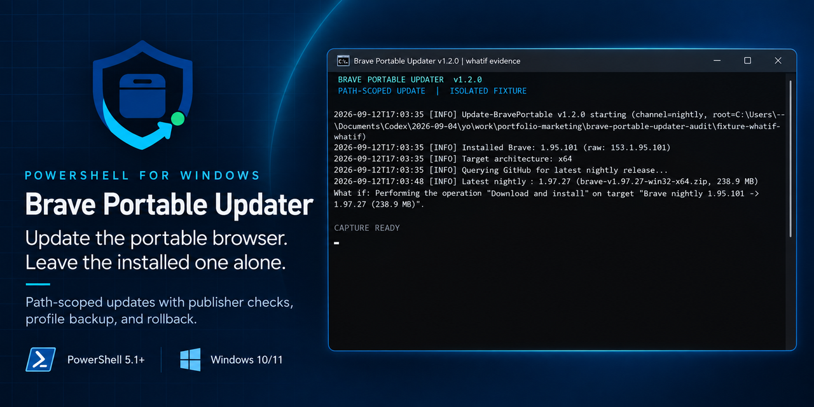
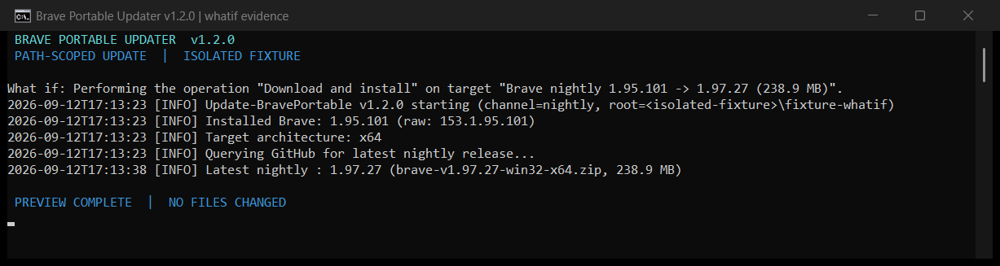
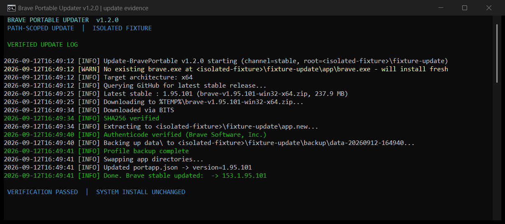
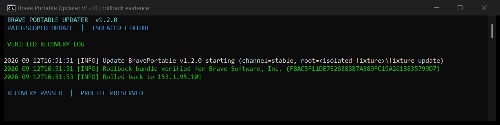

# Brave Portable Updater

[](CHANGELOG.md)
[](LICENSE)
[](#compatibility)
[](#quick-start)
[](#verification)

<p align="center">
  <a href="https://ko-fi.com/X8K126YVER">
    
  </a>
</p>

<p align="center">
  <sub><em>If this project helps you, a coffee helps me keep working on it.</em></sub>
</p>

Keep an existing [Portapps Brave](https://github.com/portapps/brave-portable) bundle current without closing or changing the system-installed browser. The updater works inside the portable root, checks the download and publisher, keeps a rollback copy, and can back up the profile before swapping files.

[Download v1.2.0](https://github.com/SysAdminDoc/Brave-Portable-Updater/releases/download/v1.2.0/Brave-Portable-Updater-v1.2.0.zip) | [Latest release](https://github.com/SysAdminDoc/Brave-Portable-Updater/releases/latest) | [Review the changelog](CHANGELOG.md)

> This is an independent community project. It is not affiliated with Brave Software or Portapps.

## Why use it

- **Your installed Brave stays open.** Process handling is limited to executables whose resolved path sits under the portable root.
- **The replacement is checked before the swap.** Published SHA256 data is verified when available, and every extracted `brave.exe` must carry a valid Brave Software publisher signature.
- **Recovery is built in.** The previous application bundle stays in `app.old` until the next successful update. Rollback verifies that bundle again before restoring it.
- **Potentially broad changes are opt-in.** The updater does not touch Brave's machine-wide update policy unless you pass `-SuppressUpdateNag`.

## See the real runs

These captures come from PowerShell 5.1 runs on isolated fixtures. They are product output, not a recreated terminal mockup.

### Preview before changing anything



`-WhatIf` resolves the requested channel and asset, then reports the pending action without downloading or replacing files.

### Verified fresh install



The fixture completed its download, SHA256 check, Authenticode publisher check, profile backup, directory swap, and `portapp.json` update.

### Verified rollback



Rollback rechecked the retained Brave bundle before restoring it. The fixture profile remained in place.

## Quick start

Download the release ZIP and extract it anywhere. PowerShell 5.1 is already included with supported Windows versions, so there is no installer or extra runtime.

Preview an update first:

```powershell
.\Update-BravePortable.ps1 `
    -PortableRoot 'D:\PortableApps\Brave' `
    -Channel stable `
    -WhatIf
```

Run the update and keep a separate profile backup:

```powershell
.\Update-BravePortable.ps1 `
    -PortableRoot 'D:\PortableApps\Brave' `
    -Channel stable `
    -BackupProfile
```

The target must contain the Portapps wrapper, `brave-portable.exe`, and its `data` directory. If `-PortableRoot` is omitted, the default is `C:\brave-portable-work`.

## Common commands

```powershell
# Let the script pick the newest available channel
.\Update-BravePortable.ps1 -PortableRoot 'D:\PortableApps\Brave' -Channel auto

# Reinstall the current release after suspected corruption
.\Update-BravePortable.ps1 -PortableRoot 'D:\PortableApps\Brave' -Force

# Restore the retained app.old bundle
.\Update-BravePortable.ps1 -PortableRoot 'D:\PortableApps\Brave' -Rollback

# Write to the file log without interactive status output
.\Update-BravePortable.ps1 -PortableRoot 'D:\PortableApps\Brave' -Quiet

# Raise the GitHub API allowance for repeated checks
.\Update-BravePortable.ps1 -PortableRoot 'D:\PortableApps\Brave' -GitHubToken $env:GITHUB_TOKEN
```

## Options

| Option | What it does |
| --- | --- |
| `-PortableRoot <path>` | Selects the existing Portapps Brave directory. |
| `-Channel stable\|beta\|nightly\|auto` | Selects a release channel. `auto` compares all matching releases and picks the newest version. |
| `-BackupProfile` | Copies `data` before the update and keeps the three newest profile backups. A failed requested backup stops the update. |
| `-Rollback` | Verifies and restores the retained `app.old` bundle. |
| `-WhatIf` | Resolves the release and previews the action without changing files. |
| `-Force` | Reinstalls even when the current version matches. It also allows downloading on a metered connection. |
| `-Quiet` | Keeps status in `<root>\log\update.log` without interactive output. |
| `-GitHubToken <token>` | Uses an existing token for a higher GitHub API rate limit. |
| `-SuppressUpdateNag` | Opts into a machine-wide Brave registry policy. This can also affect an installed Brave browser. |

Exit code `0` means the bundle was already current, updated successfully, rolled back successfully, or completed a WhatIf preview. Failures return a nonzero exit code and write the reason to the log.

## Safety model

1. Validate the Portapps wrapper and profile directory under the requested root.
2. Read the installed version from `app\brave.exe` and select a matching official GitHub release for x64 or ARM64.
3. Download to the Windows temporary directory and verify the published SHA256 digest when GitHub provides one.
4. Extract into `app.new`, then require a valid Authenticode signature issued to Brave Software, Inc.
5. Stop only Brave processes whose executable paths resolve under the portable root.
6. Move the active bundle to `app.old`, promote the verified bundle, and update `portapp.json` without a UTF-8 byte-order mark.

If GitHub does not publish a usable digest, the updater reports that fact and still requires the signed Brave executable before any swap. Existing `app.old` content is not removed until the replacement has passed extraction, publisher verification, and any requested profile backup.

## Run at startup

```powershell
.\run_at_boot.ps1
```

The helper elevates once and registers a scheduled task named `BravePortableUpdate`. The task runs the updater quietly at system startup and stops after 15 minutes.

```cmd
schtasks /run /tn BravePortableUpdate
schtasks /query /tn BravePortableUpdate /v /fo LIST
schtasks /delete /tn BravePortableUpdate /f
```

## Compatibility

- Windows 10 or Windows 11
- Windows PowerShell 5.1 or PowerShell 7+
- Official Brave Windows x64 and ARM64 ZIP releases
- Portapps layout with `<root>\app`, `<root>\data`, and `<root>\brave-portable.exe`

## Verification

Version 1.2.0 passed 51 Pester tests in Windows PowerShell 5.1 and PowerShell 7. The release exercise also completed a real stable download, SHA256 verification, Brave publisher verification, profile backup, fresh install, and signed rollback against isolated fixtures. The system Brave executable, its running processes, and the machine-wide policy state were checked before and after the exercise and did not change.

Run the local suite:

```powershell
Invoke-Pester .\tests
```

Build the release ZIP and checksums:

```powershell
.\tools\Build-Release.ps1
```

## Project files

| Path | Purpose |
| --- | --- |
| `Update-BravePortable.ps1` | Main updater and rollback command. |
| `Update-BravePortable.bat` | Argument-forwarding command prompt launcher. |
| `update.bat` | One-click stable update. |
| `update_then_run_brave.bat` | Updates, then opens the portable wrapper. |
| `run_at_boot.ps1` | Scheduled task registration helper. |
| `tests` | PowerShell 5.1 and PowerShell 7 regression coverage. |

## License

[MIT](LICENSE)
